<table>
<tr>
<td valign="top"></td>
<td valign="top">
   
  
</td>
</tr>
</table>

## Yogesh Modi

**Full-Stack Developer · AI/ML Engineer · B.Tech AI Student**

 

---

### 🎯 Interests

Full-stack systems & product engineering. Exploring **AI/ML**, **agentic systems**, and **LangGraph workflows** on the side.

---

### 🚧 What I'm Doing Right Now

- 🏙️ Building CommunityOS — civic issue reporting platform (Turborepo monorepo)
- 🤖 Exploring LangGraph multi-agent orchestration for hackathon projects
- 📚 B.Tech AI student @ Rishihood University

---

### 🧱 Things I've Built

- **[CommunityOS](https://github.com/YogeshModi24/CommunityOS)** — full-stack civic issue reporting platform with citizen/municipality role separation and ward-based access control (Next.js, Express, MongoDB, Socket.io)
- **[ChemDirect](https://github.com/YogeshModi24/ChemDirect)** — LLM-driven transactional search platform for chemical & organic products. Smart filtering algorithm surfacing direct purchase links, cutting researcher sourcing time by **70%** (Next.js, Node.js, LLM APIs, crawler-based architecture)
- **[Last-Minute Life Saver](https://github.com/YogeshModi24/last-minute-life-saver)** — AI-powered deadline management system with LangGraph multi-agent orchestration
- **[Autonomous Research Assistant](https://github.com/YogeshModi24/autonomous-research-assistant)** — hierarchical multi-agent system with ChromaDB RAG memory & FastAPI SSE streaming

**Repos worth a look**
- [`watch-the-watchers`](https://github.com/YogeshModi24/watch-the-watchers)
- [`vitalog`](https://github.com/YogeshModi24/vitalog)
- [`breathe-esg-ingestor`](https://github.com/YogeshModi24/breathe-esg-ingestor)
- [`smart-queue`](https://github.com/YogeshModi24/smart-queue)

---

### ⚙️ Tech Stack

**Languages**

  
  
  
  
  
  
  

**Frontend**

  
  
  

**Backend & Runtime**

  
  
  
  

**AI / ML**

  
  
  
  
  

**Databases & ORMs**

  
  
  
  
  

**Data & Analytics**

  
  
  
  
  
  

**Cloud & DevOps**

  
  
  
  
  

---

### 📊 Showcase

  

  

